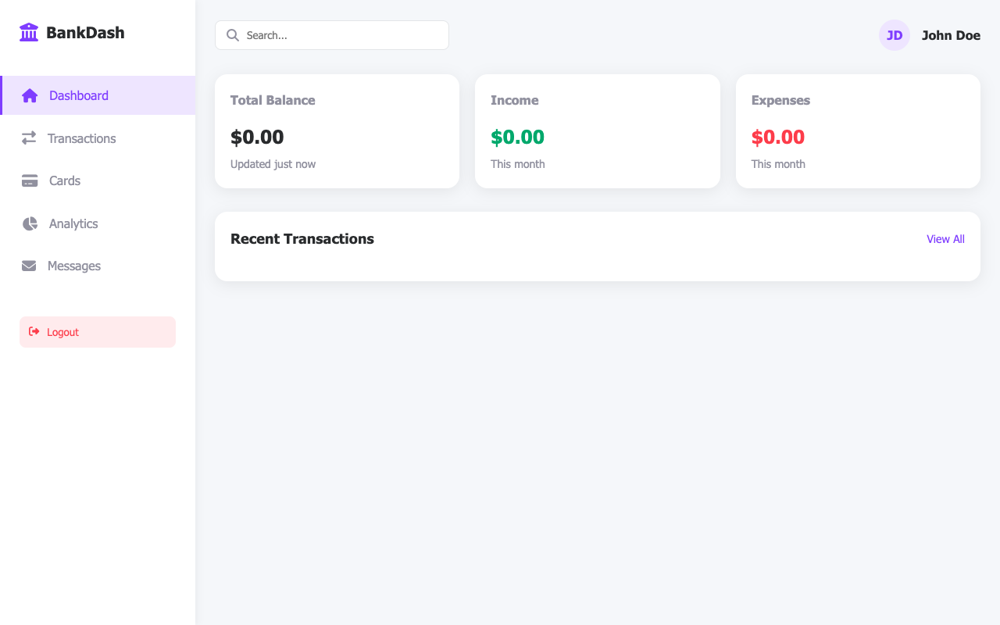

# BankDash - Banking Dashboard Application

BankDash is a modern banking dashboard application that provides users with a comprehensive view of their financial data, including transactions, cards, analytics, and messages.



## Features

- **User Authentication**: Secure login and registration system
- **Dashboard Overview**: View total balance, income, expenses, and recent transactions
- **Transactions Management**: View and filter all transactions
- **Cards Management**: View all bank cards with details
- **Analytics**: Track spending patterns and savings goals
- **Messaging System**: View and manage notifications and messages
- **Financial Calculations**: Real-time calculation of financial metrics based on transaction data

## Technology Stack

- **Frontend**: HTML, CSS, JavaScript
- **Backend**: Node.js, Express.js
- **Testing**: Jest, Puppeteer

## Project Structure

```
BankDash/
├── public/                 # Frontend assets
│   ├── css/                # CSS stylesheets
│   ├── js/                 # JavaScript files
│   ├── index.html          # Main dashboard page
│   ├── login.html          # Login page
│   └── register.html       # Registration page
├── src/                    # Backend source code
│   ├── data/               # Sample data
│   ├── routes/             # API routes
│   ├── utils/              # Utility functions
│   │   └── calculations.js # Financial calculation utilities
│   └── server.js           # Express server
└── test/                   # Test files
    ├── screenshots/        # Test screenshots
    ├── app.test.js         # Application tests
    ├── auth.test.js        # Authentication tests
    ├── browser-tools.test.js # Browser tools tests
    ├── calculations.test.js  # Calculation utilities tests
    ├── dashboard-calculations.test.js # Dashboard calculation tests
    └── dashboard.test.js   # Dashboard tests
```

## Getting Started

### Prerequisites

- Node.js (v14 or higher)
- npm (v6 or higher)

### Installation

1. Clone the repository:
   ```
   git clone https://github.com/yourusername/bankdash.git
   cd bankdash
   ```

2. Install dependencies:
   ```
   npm install
   ```

3. Start the server:
   ```
   node src/server.js
   ```

4. Open your browser and navigate to:
   ```
   http://localhost:5000
   ```

## Testing

BankDash includes comprehensive tests using Jest and Puppeteer:

- Run all tests:
  ```
  npm test
  ```

- Run specific test file:
  ```
  npx jest test/dashboard.test.js
  ```

- Run calculation utility tests:
  ```
  npx jest test/calculations.test.js
  ```

## Financial Calculation Utilities

BankDash includes a set of utility functions for financial calculations:

- **calculateTotalIncome**: Calculate total income from transactions
- **calculateTotalExpenses**: Calculate total expenses from transactions
- **calculateBalance**: Calculate balance (income - expenses)
- **calculateSpendingByCategory**: Calculate spending by category
- **calculateMonthlySpending**: Calculate monthly spending totals

These utilities are used throughout the application to provide real-time financial insights based on transaction data.

## Browser Tools Integration

BankDash integrates with browser tools for testing and debugging:

- Console log and error capture
- Network request monitoring
- Screenshot capture
- DOM interaction (finding, hovering, clicking elements)
- JavaScript execution in browser context

## Authentication Testing

The application includes authentication testing capabilities:

- User registration testing
- Login with valid credentials
- Failed login attempts
- Session management
- Logout functionality

## License

This project is licensed under the MIT License - see the LICENSE file for details.

## Acknowledgements

- Font Awesome for icons
- Jest and Puppeteer for testing framework 